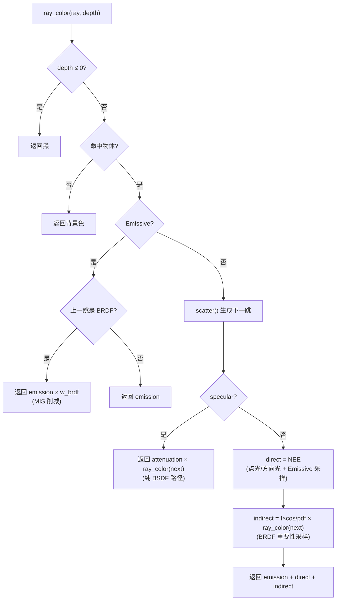
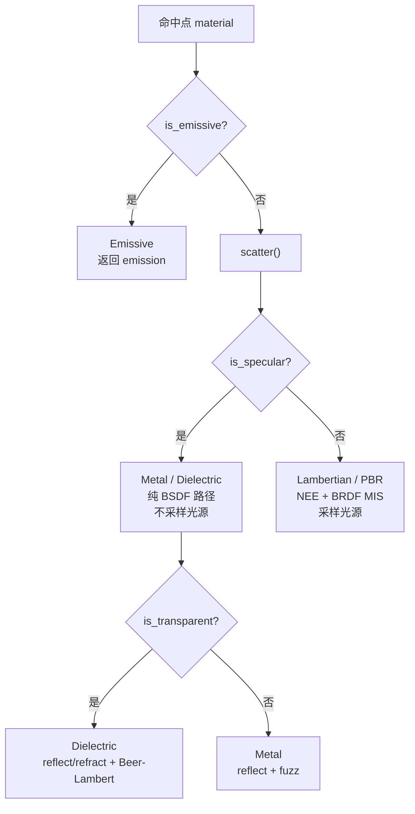
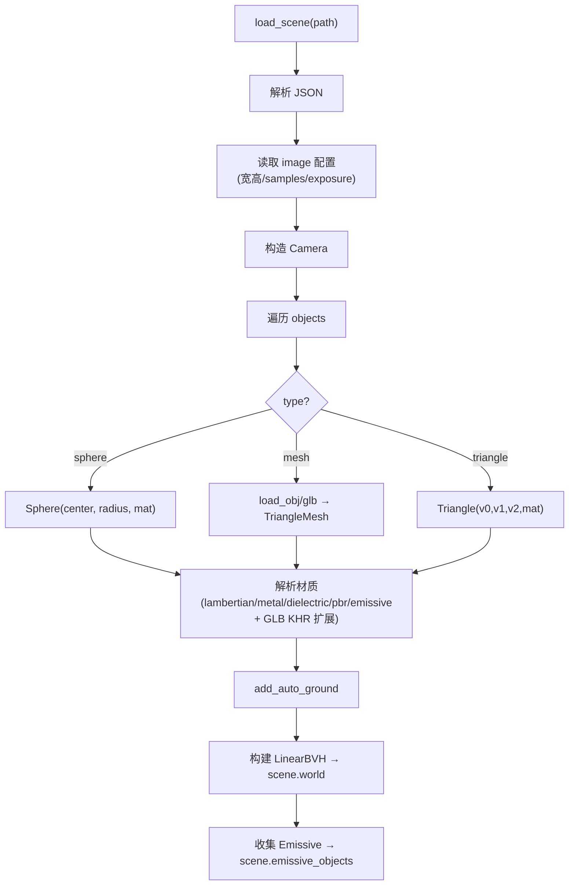

# 渲染器架构详解

> 本文是原理深度详解，配合 `docs/render-flow.md`（流程图速查）阅读。
> `render-flow.md` 回答"什么在跑"，本文回答"为什么这么跑"。
>
> 如果你刚开始接触这个项目，建议先看 `render-flow.md` 的流程图建立全局印象，
> 再回到本文了解每一步背后的物理和数学原理。

## 目录

- [1. 全景：渲染器在做什么](#1-全景渲染器在做什么)
- [2. 渲染主循环 render_scene()](#2-渲染主循环-render_scene)
- [3. 相机与主射线](#3-相机与主射线)
- [4. ray_color() 主递归函数](#4-ray_color-主递归函数)
- [5. 材质行为详解](#5-材质行为详解)
- [6. BVH 加速结构](#6-bvh-加速结构)
- [7. 场景加载流程](#7-场景加载流程)
- [8. 色调映射](#8-色调映射)
- [9. 完整走一遍：glass_bottle 示例](#9-完整走一遍glass_bottle-示例)
- [10. 术语表](#10-术语表)

---

## 1. 全景：渲染器在做什么

**一句话**：对图像里每个像素，从相机射出一条光线穿过这个像素，追踪这条光线在场景里的弹跳，每次弹跳算它带了什么颜色回来，最后把颜色写进像素。

**物理类比**：想象你在黑暗的房间里，相机是眼睛。每个像素是你视野里的一个小方向。你往那个方向"看"出去一条视线——视线可能打到墙壁、地板、玻璃瓶、或者飞出窗外看到天空。打到物体时，那个点被光源照亮（直接光），或者被其他物体反射的光照亮（间接光）。视线在镜面/玻璃上还会弹射或穿透继续走。最后视线带回来的颜色，就是你在这个像素位置看到的颜色。

这就是**光线追踪（Ray Tracing）**的核心思想：用光线在场景里的物理弹射，模拟真实世界里光从光源出发、经过各种反射折射、最终进入相机的过程。只不过光线追踪是**反向**的——从相机往场景射光线，而不是从光源往相机射。反向追踪更高效，因为只追踪最终能进入相机的那部分光线。

---

## 2. 渲染主循环 render_scene()

**代码位置**：`renderer.h:185`

```cpp
for 每个像素 (i, j):
    for 每个 sample (1..N):
        u = i / width, v = j / height
        primary_ray = camera.get_ray(u, v)
        color += ray_color(primary_ray, scene, max_depth, ...)
    pixels[j][i] = color / N
```

### 像素到射线的映射

相机把 2D 像素坐标 `(u, v)` 映射成 3D 射线方向。`u, v ∈ [0,1]` 是像素在图像里的归一化位置——`(0,0)` 是图像左下角，`(1,1)` 是右上角。相机根据 FOV 和朝向算出这条射线在 3D 空间的起点和方向。

### 多次采样与抗锯齿

每个像素不只发一条光线，而是发 N 条（默认 16 或 32，由场景 JSON 的 `image.samples` 决定），每条在像素内随机抖动一点位置：

```cpp
double offset_x = random_double();  // [0,1) 随机偏移
double offset_y = random_double();
double u = (i + offset_x) / (scene.width - 1);
double v = (sample_row + offset_y) / (scene.height - 1);
```

N 条光线的颜色平均后写入像素——这是**抗锯齿**的原理：像素边缘只发一条线会锐利锯齿，多条线平均后边缘自然柔和。采样越多，噪声越低，但耗时线性增长。

### 多线程

`render_worker` 跑在多个线程上，每个线程用原子操作抢一行（`next_row.fetch_add`）来渲染：

```cpp
std::atomic<int> next_row{0};
auto render_worker = [&]() {
    while (true) {
        int j = next_row.fetch_add(1);  // 原子地取下一行
        if (j >= scene.height) break;
        // 渲染第 j 行...
    }
};
```

线程数默认是 `std::thread::hardware_concurrency()`（CPU 硬件线程数），也可通过 `--threads` 命令行参数指定。这就是为什么 600×600 的图 2 秒就能跑完——10 个线程并行渲染不同行。

---

## 3. 相机与主射线

**代码位置**：`camera.h`

### 相机的 7 个参数

| 参数 | 含义 | 典型值 |
|------|------|--------|
| `lookfrom` | 相机位置 | `(4, 2.5, 4)` |
| `lookat` | 相机看向的点 | `(0, 1.5, 0)` |
| `vup` | 相机上方向 | `(0, 1, 0)` |
| `vfov` | 垂直视野角（度） | 30（窄视角）~ 65（广角） |
| `aperture` | 光圈孔径 | 0 = 无景深，>0 = 有景深 |
| `focus_dist` | 对焦距离 | 相机到对焦平面的距离 |
| `aspect` | 宽高比 | width / height |

### 相机坐标系的构建

相机构造时算出三个正交基向量，定义相机的局部坐标系：

```cpp
Vec3 w = (lookfrom - lookat).normalized();  // 相机朝向的反方向（"往后"）
Vec3 u = cross(vup, w).normalized();        // 相机右手方向
Vec3 v = cross(w, u);                        // 相机上方
```

然后算出视口（图像平面）的大小和位置：

```cpp
double viewport_h = 2 * tan(vfov_radians / 2);     // 视口高度
double viewport_w = aspect * viewport_h;            // 视口宽度
lower_left = origin - horizontal/2 - vertical/2 - focus_dist * w;
```

### 主射线的生成

`get_ray(u, v)` 把像素的归一化坐标转换成 3D 射线：

```cpp
Ray get_ray(double s, double t) const {
    Vec3 dir = lower_left + s * horizontal + t * vertical - origin;
    return Ray(origin, dir);
}
```

### 景深（aperture > 0）

当 `aperture > 0` 时，射线起点在光圈圆盘内随机偏移：

```cpp
Vec3 rd = lens_radius * random_in_unit_disk();
Vec3 offset = u_ * rd.x + v_ * rd.y;
Point3 origin = origin_ + offset;
```

这模拟了真实镜头的光圈——光圈越大，不在对焦平面上的物体越模糊。`aperture=0` 时所有距离都清晰（针孔相机模型）。

---

## 4. ray_color() 主递归函数

**代码位置**：`renderer.h:85`

这是整个渲染器的心脏。一条光线进来，它做以下决策树：



### 4.1 深度检查

```cpp
if (depth <= 0) return Color(0, 0, 0);
```

光线在场景里会反复弹射（墙→球→地板→天花板→...），如果不限制就会无限递归。`max_depth`（默认 32，由场景 JSON 的 `image.max_depth` 决定）限制最多弹射多少次。用完后返回黑色——相当于"这条光线弹了太多次，能量耗尽"。

### 4.2 命中测试与背景

```cpp
if (!scene.world->hit(r, 0.001, infinity, rec)) {
    return background_color(r, scene);
}
```

`scene.world` 是 BVH（包围盒层次结构）加速结构。`hit()` 用 BVH 快速判断光线是否碰到任何物体，返回最近交点的信息 `HitRecord`（交点位置、法线、材质指针、UV、切线等）。

`0.001` 是最小命中距离——避免光线从交点出发后立刻命中自己（自阴影问题）。

**未命中 → 返回背景**（`renderer.h:76`）：
- `BackgroundType::Sky`：蓝白渐变天空，`t = 0.5 * (dir.y + 1)`，向上偏蓝、向下偏白
- `BackgroundType::Solid`：纯色背景（JSON 可配 `background.color`）

### 4.3 Emissive 命中与 MIS 权重

```cpp
if (rec.material && rec.material->is_emissive()) {
    Emissive* em = static_cast<Emissive*>(rec.material);
    if (prev_brdf && prev_pdf > 0 && !scene.emissive_objects.empty()) {
        // ... 计算 w_brdf ...
        return em->emission * w_brdf;
    }
    return em->emission;
}
```

`Emissive` 材质（面光源）自己发光。命中它时不需要被照亮——直接返回它发出的颜色 `emission`。

**但有 MIS 权重**：如果这条光线是**上一跳材质随机反弹出来的**（`prev_brdf == true`），说明它"碰巧"打到了发光体。这种情况下不能直接返回全部 `emission`——因为我们还有另一条路径（NEE 主动采样光源）也在估算同一个发光体的贡献。两条路径都算会**重复计数**，所以要用 MIS 权重 `w_brdf` 削减 BSDF 路径的贡献：

```cpp
double w_brdf = prev_pdf / (prev_pdf + pdf_light);
return em->emission * w_brdf;
```

- **`prev_pdf`**：上一跳 BSDF 采样生成这条光线的概率密度
- **`pdf_light`**：如果用 NEE 主动采样光源，采到这个发光体上这个点的概率密度

两者概率都高时 `w_brdf ≈ 0.5`，一高一低时偏向高的一方。这是 MIS 的核心——**让两种采样方法都贡献，但按各自的可靠性加权**，避免重复计数。

### 4.4 材质散射

```cpp
bool did_scatter = rec.material && rec.material->scatter(r, rec, attenuation, scattered, emission);
```

`scatter()` 是材质的核心方法，返回：
- `scattered`：下一跳光线（从交点往新方向走）
- `attenuation`：这次散射的颜色衰减（光被材质吸收了多少）
- `emission`：材质自身发光（非 Emissive 材质返回 0）
- `did_scatter`：是否成功散射（Emissive 返回 false）

不同材质的 `scatter()` 行为见[第 5 章](#5-材质行为详解)。

### 4.5 Specular 路径（金属/玻璃）

```cpp
if (rec.material && rec.material->is_specular()) {
    if (!did_scatter) return emission;
    double brdf_pdf = rec.material->pdf(r, scattered, rec);
    if (brdf_pdf <= 0) brdf_pdf = 1;
    return emission + attenuation * ray_color(scattered, scene, depth - 1, options, brdf_pdf, true);
}
```

`is_specular() == true` 的材质（Metal 镜面、Dielectric 玻璃）走**纯 BSDF 路径**——只跟着 `scatter()` 生成的反射/折射光线走，**不主动采样光源**。

**为什么不采样光源？** 镜面反射的方向是确定的（反射定律/折射定律），你主动往光源方向采样没有意义——因为从当前点看光源的方向，反射后并不会指向相机。只有跟着镜面方向走才能正确追踪光路。这在图形学里叫 **delta 分布材质**——方向是确定的一个点，不是分布。

**`attenuation * ray_color(next)`**：下一跳带回来的颜色乘以本次衰减。比如红色金属反射 80% 的光 → `attenuation = (0.8, 0.8, 0.8)` → 下一跳颜色乘 0.8。

### 4.6 非 Specular 路径（NEE + BRDF MIS）

Lambertian（漫反射）和 PBR（Cook-Torrance）走这条路径。分两部分：

#### A. 直接光照（NEE = Next Event Estimation）

```cpp
Color direct = direct_delta_lights(r, rec, scene);  // 点光/方向光
// + Emissive 面光源采样（见下文）
```

**`direct_delta_lights`**（`renderer.h:40`）遍历所有点光/方向光：
- 计算光源方向和距离衰减
- 发阴影射线测试可见性
- 未遮挡则累加 `f * Li * cos`：
  - `f = material->f(r_in, light_ray, rec)`：问材质"光从这个方向来，反射到相机方向多少？"
  - `Li = light.color * light.intensity * attenuation`：光源亮度 × 距离衰减
  - `cos = dot(normal, light_dir)`：Lambert 余弦定律

**Emissive 面光源采样**（`renderer.h:124-155`）：
- 随机选一个发光物体（`emissive_objects` 列表）
- 在它表面按面积加权随机取一个点（`sample_point(r1, r2, &normal)`）
- 往那个点发阴影射线，未遮挡则累加：

```cpp
direct += eo.emission * f_val * n_dot_l * w_light / pdf_light;
```

- `pdf_light = dist² / (cos_light * total_area)`：在立体角意义下采到这个方向的概率
- `w_light = pdf_light / (pdf_light + brdf_pdf)`：MIS 权重——光源采样和 BRDF 采样都可能找到这个方向，按概率加权

#### B. 间接光照（BRDF 采样 + 递归）

```cpp
double brdf_pdf = material->pdf(r, scattered, rec);
Color f_val = material->f(r, scattered, rec);
Color indirect = f_val * dot(rec.normal, scattered.direction) / brdf_pdf
               * ray_color(scattered, scene, depth - 1, options, brdf_pdf, true);
return emission + direct + indirect;
```

- `material->scatter()` 已经用 BRDF 重要性采样生成了 `scattered` 方向
- `pdf = material->pdf(...)`：这个方向被采到的概率密度
- `f = material->f(...)`：材质在这个方向的反射比例
- `f * cos / pdf`：蒙特卡洛估计的间接光——除以 pdf 是**重要性采样**的核心，让高概率方向权重低、低概率方向权重高，保证无偏估计
- 递归 `ray_color(scattered, ..., prev_pdf=brdf_pdf, prev_brdf=true)`：追踪下一跳，并把自己的 pdf 传下去，让下一跳命中 Emissive 时能算 MIS 权重

**为什么 direct + indirect 不重复？** MIS 的数学保证：
- 光源采样路径（direct）用 `w_light` 削减
- BRDF 路径命中 Emissive 时用 `w_brdf` 削减
- `w_light + w_brdf = 1`（数学恒等）
- 所以同一发光体的贡献只被完整计一次

---

## 5. 材质行为详解

**代码位置**：`material.h`

材质分派逻辑：



### 5.1 Lambertian（漫反射）

**代码位置**：`material.h:38`

| 属性 | 值 | 含义 |
|------|-----|------|
| `is_specular` | false | 走 NEE + BRDF MIS 路径 |
| `is_emissive` | false | 不发光 |
| `is_transparent` | false | 不透明 |
| `scatter()` | `dir = normal + random_unit_vector()` | 余弦加权随机方向 |
| `f()` | `albedo / π` | 物理 BRDF（能量守恒） |
| `pdf()` | `cos / π` | 余弦加权采样概率 |

**原理**：理想漫反射——光均匀散射到所有方向。

**为什么 `f = albedo / π`？** 来自能量守恒。反射的总能量不能超过入射能量：

```
∫_半球 f × cos(θ) dω ≤ 1
```

半球积分 `∫cos(θ) dω = π`，所以 `f × π ≤ 1` → `f ≤ 1/π`。如果 `albedo=1`（完美白墙），`f = 1/π` 保证反射 100% 的入射能量。不除 π 的话 `albedo=1` 会反射 π≈3.14 倍能量，违反能量守恒。

**采样**：`normal + random_unit_vector()` 近似余弦分布——方向偏向法线，偏离时概率降低。这是**重要性采样**——高概率方向（靠近法线）多采，低概率方向少采，比均匀采样高效。

### 5.2 Metal（金属）

**代码位置**：`material.h:75`

| 属性 | 值 | 含义 |
|------|-----|------|
| `is_specular` | true | 走纯 BSDF 路径 |
| `scatter()` | `reflect(dir, normal) + fuzz * random_in_unit_sphere()` | 反射方向 + 模糊 |
| `f()` | 返回 0（specular 不走 NEE） | — |

**原理**：金属反射遵循反射定律（入射角=反射角）。`fuzz` 控制粗糙度：
- `fuzz=0`：完美镜面（像镜子）
- `fuzz>0`：在反射方向加随机扰动，模拟磨砂金属（拉丝铝、粗糙铜器）

`fuzz` 的物理意义是微面元的粗糙度——表面微观上看是无数小镜面，粗糙表面的小镜面朝向随机，所以反射方向有扩散。

### 5.3 Dielectric（玻璃）

**代码位置**：`material.h:103`

| 属性 | 值 | 含义 |
|------|-----|------|
| `is_specular` | true | 走纯 BSDF 路径 |
| `is_transparent` | true | 透明 |
| `scatter()` | Schlick 菲涅尔 + reflect/refract 二选一 | 玻璃的核心逻辑 |

**菲涅尔效应**：光打到玻璃表面时，一部分反射、一部分折射。比例取决于入射角：
- 正面看玻璃（垂直）：大部分光透射过去
- 掠射角看玻璃（几乎平行）：大部分光反射

`schlick(cos, ratio)` 近似菲涅尔系数 R——反射概率：

```cpp
double r0 = (1 - ref_idx) / (1 + ref_idx);
r0 = r0 * r0;
return r0 + (1 - r0) * pow(1 - cosine, 5);
```

然后随机赌：`if (random < R) reflect else refract`。

**全反射**：`cannot_refract = ratio * sin_theta > 1.0`——光从密介质到疏介质且角度太大时，光无法折射，全部反射。这是玻璃瓶边缘发亮的原理。

**折射方向**用 Snell 定律计算（`vec3.h` 的 `refract()` 函数）。

**体积吸收（Beer-Lambert）**：

```cpp
if (attenuation_distance > 0 && !rec.front_face) {
    double dist = rec.t;
    double r = pow(attenuation_color.x, dist / attenuation_distance);
    // ...
    attenuation = base * Color(r, g, b);
}
```

光在玻璃内行走距离 `t` 时，颜色按 `pow(attenuation_color, t/distance)` 衰减——厚处色深、薄处色淡。参数来自 GLB 的 `KHR_materials_volume` 扩展或 JSON 的 `attenuation_color`/`attenuation_distance` 字段。

### 5.4 PBR（Cook-Torrance）

**代码位置**：`material.h:163`

| 属性 | 值 | 含义 |
|------|-----|------|
| `is_specular` | false | 走 NEE + BRDF MIS 路径 |
| `scatter()` | GGX 重要性采样 half-vector | 高光集中在镜面方向 |
| `f()` | `kD*base/π + F*D*G/(4*NdotL*NdotV)` | diffuse + specular |
| `pdf()` | `D * NdotH / (4 * VdotH)` | GGX 法线分布 pdf |

**Cook-Torrance BRDF** = 漫反射项 + 微面元镜面项：

```
f = kD * base / π + F * D * G / (4 * NdotL * NdotV)
    ─────────────   ──────────────────────────────
    diffuse 项       specular 项
```

**D (GGX 法线分布)**：微面元法线朝 half-vector 方向的比例。`roughness` 控制分布宽度——`roughness=0` 镜面（所有微面元朝同一方向），`roughness=1` 漫反射（完全随机）。

**G (Smith 几何遮挡)**：微面元之间互相遮挡的程度。掠射角时遮挡严重，G 值小。

**F (Schlick 菲涅尔)**：多少光反射 vs 漫反射。非金属 F0=0.04，金属 F0=base color。

**重要性采样**：`scatter()` 按 GGX 分布采样 half-vector（高光方向概率高），比均匀采样高效得多——32 samples 就能得到干净的高光。

### 5.5 Emissive（面光源）

**代码位置**：`material.h:313`

| 属性 | 值 | 含义 |
|------|-----|------|
| `is_emissive` | true | 标记为发光体 |
| `scatter()` | 返回 false（不散射） | — |
| `emission` | 可 >1 | 高亮度补偿小面积 |

**原理**：面光源是物理正确的光源——有面积、有形状，产生**软阴影**（边缘渐变）。点光源是"理想点"产生**硬阴影**（一刀切）。Emissive 材质让任何几何体都能当光源：天花板、灯泡、霓虹灯。

`emission` 值可以大于 1（如 `[15, 15, 15]`），因为面积小的面光源需要高辐射度才能照亮整个场景。最终的色调映射会把 HDR 压缩到显示范围。

---

## 6. BVH 加速结构

**代码位置**：`bvh.h:21`（场景级）、`triangle_mesh.h:258`（网格级）

### 为什么需要加速

场景有几千个三角形，每条光线要和每个三角形求交 → O(N) 太慢。600×600×32 samples = 1152 万条主光线，每条递归 ~10 跳，每跳和 1000 个三角形求交 = 1152 亿次求交——不可接受。

### BVH 原理

BVH（Bounding Volume Hierarchy，包围盒层次结构）把三角形按空间组织成树：
- 每个内部节点是一个 AABB（轴对齐包围盒），存左右子树
- 叶子节点存实际三角形

**遍历**：光线先和根节点 AABB 求交——没命中就整个子树跳过。命中则递归检查左右子树。平均 **O(log N)**——1000 个三角形只需 ~10 次 AABB 测试。

### 构建

```cpp
// bvh.h build()
1. 计算所有图元的包围盒
2. 按最长轴排序
3. 取中点划分为左右两组
4. 递归构建左右子树
5. 叶子粒度 1（每叶子 1 个图元）
```

### 双层 BVH

项目有两层 BVH：
- **场景级**（`bvh.h`）：把不同物体（球、网格、三角形）组织成树
- **网格级**（`triangle_mesh.h:258`）：单个 `TriangleMesh` 内部的数千三角形组织成树

光线先走场景级 BVH 找到命中的物体，如果是 `TriangleMesh`，再走其内部 BVH 找到命中的三角形。

### 栈遍历

```cpp
constexpr int MAX_STACK = 64;
int stack[MAX_STACK];
int sp = 0;
stack[sp++] = 0;  // 从根节点开始
while (sp > 0) {
    int node_idx = stack[--sp];
    if (!node.box.hit(r, t_min, closest)) continue;  // 包围盒未命中，跳过
    if (node.is_leaf) { /* 检查叶子里的三角形 */ }
    else { stack[sp++] = node.left; stack[sp++] = node.right; }
}
```

用栈数组（非递归）遍历，避免递归开销，深度上限 64。这个设计是为未来 GPU 移植做准备——GPU 栈遍历比递归更友好。

---

## 7. 场景加载流程

**代码位置**：`scene.h:629 load_scene()`



### 关键步骤

1. **JSON 解析**（`json.h`）：手写的零依赖解析器，支持 object/array/string/number/bool/null

2. **物体构造**：
   - `sphere` → `Sphere(center, radius, material)`
   - `mesh` → `load_obj_mesh` / `load_glb_mesh` → `TriangleMesh`（含内部 BVH）
   - `triangle` → `Triangle(v0, v1, v2, material)`

3. **材质路由**（`scene.h:168 parse_material`）：
   - JSON 显式材质：按 `type` 字段实例化（lambertian/metal/dielectric/pbr/emissive）
   - GLB 内嵌材质（`scene.h:248 add_loaded_material`）按启发式路由：
     - `transmission > 0.5 || alpha_blend` → `Dielectric`（玻璃）
     - `metallic > 0.5` → `Metal`
     - 否则 → `Lambertian`
   - KHR 扩展：`KHR_materials_transmission`/`ior`/`volume`

4. **自动地面**（`add_auto_ground`）：如果场景配置了 `ground.enabled`，自动在模型下方加一个大平面接收阴影

5. **BVH 构建**：`scene.world = LinearBVH(scene.primitives.objects)` 把所有物体组织成加速结构

6. **Emissive 收集**：遍历所有物体，`is_emissive()` 的收集到 `scene.emissive_objects`，用于 NEE 采样

---

## 8. 色调映射

**代码位置**：`image.h write_ppm()`

### 问题

渲染过程产生的颜色是**线性 HDR**（High Dynamic Range）——值可以 >1（面光源 emission=15）或 <0（极少）。但显示设备只能显示 [0, 255] 的 8-bit RGB。

### 流程

```
raw_color (线性 HDR, 可 >1)
    ↓ × exposure (可调, 默认 1.0)
    ↓ filmic_tonemap (Uncharted 2 曲线, 压缩 HDR 到 ~[0,1])
    ↓ gamma2 (sqrt, sRGB 伽马校正)
    ↓ × 256 + clamp
final 8-bit RGB (0-255)
```

### Filmic 曲线 vs 硬 clamp

**硬 clamp**（旧代码）：`v > 0.999 ? 0.999 : v`——高光直接截断成白色，丢失颜色信息。玻璃高光、面光源直射会变成"死白"。

**Filmic 曲线**（Uncharted 2 / Hable 2010）：

```cpp
inline Color filmic_tonemap(Color x) {
    double A = 0.22, B = 0.30, C = 0.10, D = 0.20, E = 0.01, F = 0.30;
    return ((x*(A*x + C*B) + D*E) / (x*(A*x + B) + D*F)) - E/F;
}
```

让高光自然过渡到白色——亮区保留色彩渐变，暗区提升对比度，类似电影胶片的响应曲线。

### exposure

`image.exposure`（JSON 可配，默认 1.0）在色调映射前乘到颜色上——相当于相机的曝光补偿。场景太暗就调高（如 2.0），太亮就调低。

### gamma 校正

`gamma2(c) = sqrt(c)`——sRGB 色彩空间的近似伽马校正。人眼对暗部变化更敏感，伽马校正把线性空间的暗部"展开"，让显示结果符合人眼感知。

---

## 9. 完整走一遍：glass_bottle 示例

以 `scenes/glass_bottle.json` 为例，追踪像素 (300, 300) 的一条采样光线的完整旅程：

### 场景配置回顾

```json
{
    "camera": { "lookfrom": [4,2.5,4], "lookat": [0,1.5,0], "vfov": 30 },
    "ground": { "enabled": true, "material": { "type": "lambertian", "albedo": [0.5,0.5,0.5] } },
    "objects": [{
        "type": "mesh",
        "file": "../models/glb/glass.glb",
        "auto_fit": true, "fit_center": [0,1.5,0]
    }]
}
```

瓶子是 GLB 模型，材质 `alphaMode: BLEND` → 自动识别为 `Dielectric(ior=1.5)`。

### 光线旅程

1. **`render_scene`**：像素 (300,300)，发 32 条采样光线，这里追踪其中一条

2. **`camera.get_ray(0.5, 0.5)`**：从 (4,2.5,4) 朝瓶子中心方向射出

3. **`ray_color`**：光线穿过场景级 BVH，命中 `TriangleMesh`（瓶子），进入网格内部 BVH 找到具体三角形

4. **材质判断**：`Dielectric`，`is_specular=true`，走纯 BSDF 路径

5. **`scatter`**：Schlick 菲涅尔算反射概率 R
   - 正面命中：R 小，大概率折射 → 光线进入玻璃内部
   - 掠射角命中：R 大，大概率反射 → 光线弹回外部

6. **假设折射进入玻璃**：`attenuation = base_color * Beer-Lambert`（如果配了体积吸收，厚处颜色更深）

7. **递归 `ray_color`**：光线在玻璃内行走，命中瓶子内壁
   - `front_face=false` → `ratio = ior = 1.5`（从玻璃到空气）
   - 可能全反射（`cannot_refract`），光线在玻璃内反复弹射

8. **最终折射出来**：光线离开玻璃，命中后面的地面或天空

9. **假设命中地面**：`Lambertian`，`is_specular=false`
   - **NEE**：`direct_delta_lights` 遍历太阳光和点光，发阴影射线，算 `f * Li * cos = (albedo/π) * Li * cos`
   - **BRDF 间接光**：`scatter` 随机方向 → 递归 `ray_color` → 可能命中天空返回蓝色

10. **颜色沿路径返回**：每一跳的 `attenuation` 乘起来，最终颜色回到像素

11. **32 条采样平均**：消除锯齿和噪点

12. **filmic + gamma**：`filmic_tonemap(raw * exposure=1.5)` → `gamma2` → `× 256` → 写入 PPM

这就是你看到的玻璃瓶图片背后的全部过程：一条光线从相机出发，穿过玻璃（折射），在玻璃内部弹射，折射出来打到地面（被太阳光照亮），最后带着颜色回到相机。

---

## 10. 术语表

本文档和 `render-flow.md` 中出现的核心术语，按字母排序。每条给出定义、物理含义、在本项目代码里的对应位置。

### attenuation（衰减系数）

**定义**：材质散射时返回的颜色衰减——光被材质吸收了多少，保留了多少颜色。

**物理含义**：红色物体吸收绿光和蓝光，只反射红光 → `attenuation = (0.8, 0.1, 0.1)`。下一跳带回来的颜色会乘以这个系数，模拟"这次反射只保留了红色"。

**代码**：`material.h` 各材质的 `scatter()` 通过出参 `attenuation` 返回。在 `renderer.h:122` 的 specular 路径里 `attenuation * ray_color(next)` 把它乘到下一跳颜色上。

### background（背景色）

**定义**：光线未命中任何物体时返回的颜色。

**物理含义**：相当于"看向无穷远"——户外是天空，室内可能是黑色或环境贴图。

**代码**：`renderer.h:76 background_color()`。支持两种模式：`Sky`（蓝白渐变，按射线 y 分量插值）和 `Solid`（JSON 配置的纯色）。

### BSDF（Bidirectional Scattering Distribution Function，双向散射分布函数）

**定义**：描述光线打到材质表面后，会如何向不同方向散射的函数。给定入射方向 ω_i 和出射方向 ω_o，返回散射比例。

**物理含义**："散射"比"反射"更宽泛——既可以是表面反射（漫反射、镜面反射），也可以是透射/折射（玻璃、水）。BSDF 是最通用的描述，BRDF 和 BTDF 都是它的子集。

**为什么需要 BSDF 而不只是 BRDF**：玻璃让光穿过表面，从另一侧出来——这不是"反射"，是"透射"。`Dielectric` 材质的 `scatter()` 同时处理反射和折射，本质上就是一个 BSDF（虽然代码里没有显式叫 BSDF）。

**代码**：本项目没有显式的 BSDF 类，而是通过 `Material::scatter()` + `Material::f()` + `Material::pdf()` 三个方法隐式实现。`scatter()` 做采样（选方向），`f()` 算散射值，`pdf()` 算采样概率。

### BRDF（Bidirectional Reflectance Distribution Function，双向反射分布函数）

**定义**：BSDF 的子集，只描述表面**反射**，不描述透射。单位是 1/球面度 (1/sr)。

**物理含义**：给定"光从哪个方向来"和"相机从哪个方向看"，BRDF 返回"有多少光被反射到相机方向"。不同材质的 BRDF 不同：
- **Lambertian**：常数 `albedo/π`——所有方向均匀反射
- **Cook-Torrance**：`kD*base/π + F*D*G/(4*NdotL*NdotV)`——漫反射 + 微面元镜面

**为什么 Lambertian 的 BRDF 是 albedo/π**：能量守恒。半球积分 `∫f×cos dω = albedo`，而 `∫cos dω = π`，所以 `f = albedo/π`。不除 π 的话 albedo=1 会反射 π 倍能量，违反物理。

**代码**：`material.h` 各材质的 `f()` 方法返回 BRDF 值。Lambertian 在 `material.h:63`，PBR 在 `material.h:269`。

### BTDF（Bidirectional Transmittance Distribution Function，双向透射分布函数）

**定义**：BSDF 的另一个子集，只描述**透射**（光穿过表面从另一侧出来）。

**物理含义**：玻璃的折射就是 BTDF 描述的现象——光从空气进入玻璃，方向按 Snell 定律弯折。`Dielectric::scatter()` 里的 `refract()` 调用实现了 BTDF 的采样。

**代码**：本项目没有显式分离 BTDF，折射逻辑内嵌在 `Dielectric::scatter()`（`material.h:103`）里。

### cos（余弦项 / Lambert 余弦定律）

**定义**：当前表面法线和光线方向夹角的余弦 `dot(normal, light_dir)`。

**物理含义**：表面越正对光源，接收的能量越多；越斜着被照到，单位面积接收的能量越少。这和冬天太阳斜照、夏天太阳直射导致冷暖的原理一样——斜照时能量分散到更大面积。

**代码**：直接光照里 `dot(rec.normal, light_dir)`（`renderer.h:61`），间接光里 `dot(rec.normal, scattered.direction)`（`renderer.h:169`）。

### delta light（理想点光源 / 方向光）

**定义**：没有可采样面积的理想光源。点光源是一个点，方向光来自无限远的固定方向。

**对比**：Emissive 面光源有面积，可以采样表面点；delta 光源没有面积，方向是确定的。

**代码**：`scene.h:27` 的 `LightType::Point` 和 `LightType::Directional`。`direct_delta_lights()`（`renderer.h:40`）专门处理这类光源。

### depth（递归深度）

**定义**：当前光线还允许递归反弹的剩余次数。

**物理含义**：真实世界里光会无限弹射，但计算资源有限。`max_depth` 限制最多弹射多少次，用完后返回黑色——相当于"这条光线弹了太多次，能量耗尽"。

**代码**：`renderer.h:86 if (depth <= 0) return Color(0,0,0)`。默认 32，由场景 JSON 的 `image.max_depth` 配置。

### direct-only（直接光照模式）

**定义**：快速预览模式。开启后，非 specular 材质只返回自身发光和直接光照（NEE），不继续递归追踪随机反弹得到的间接光；specular 材质也不继续追踪下一跳。

**用途**：快速预览场景构图和光照，不等待间接光收敛。通过 `--direct-only` 或 `--preview` 命令行参数启用。

**代码**：`renderer.h:157 if (options.direct_only) return emission + direct`。

### emission（自发光）

**定义**：材质自身发出的光。`emissive` 材质不需要被其他光源照亮，也可以被相机直接看到。

**物理含义**：灯泡、太阳、LED 屏幕——这些物体不靠反射别人的光，自己就是光源。`emission` 值可以 >1（如 `[15, 15, 15]`），因为面积小的面光源需要高辐射度才能照亮整个场景。

**代码**：`Emissive` 材质（`material.h:313`）的 `scatter()` 通过出参 `emission_out` 返回。其他材质返回 `Color(0,0,0)`。

### f()（BRDF/BSDF 值）

**定义**：`Material::f(r_in, scattered, rec)` 返回材质在给定入射/出射方向上的反射或散射比例。

**用途**：
- 直接光照里，渲染器已经知道"光从哪个方向来、相机在看哪个方向"，用 `f()` 问材质"这束光有多少会被反射到相机方向"
- 间接光里，`f()` 也用于给 `scatter()` 随机选出的下一跳方向计算权重

**代码**：`material.h:26` 基类虚函数。Lambertian 返回 `albedo/π`（`material.h:63`），PBR 返回 Cook-Torrance 完整 BRDF（`material.h:269`），Metal/Dielectric 返回 0（specular 不走 NEE）。

### NEE（Next Event Estimation，下一事件估计）

**定义**：不要等随机反弹碰巧打到光源，而是主动在每次表面命中时采样光源。也叫"显式光源采样"。

**原理**：纯 BRDF 采样（只跟着 `scatter()` 的随机方向走）要碰巧打到光源才亮——对点光源几乎不可能命中，导致画面全黑。NEE 在每次命中时主动往光源方向采样，保证直接光照总能被算到。

**代码**：`renderer.h:125 direct_delta_lights`（delta 光源）+ `renderer.h:124-155`（Emissive 面光源采样）。

### pdf（概率密度函数）

**定义**：`Material::pdf(r_in, scattered, rec)` 表示 BSDF 采样采到某个方向的概率密度。`pdf_light` 表示通过光源采样采到该方向的概率密度。

**为什么需要 pdf**：蒙特卡洛积分需要除以采样概率来保证无偏估计——`f * cos / pdf`。高概率方向除以大数权重低，低概率方向除以小数权重高，最终期望值正确。

**代码**：`material.h:30` 基类虚函数。Lambertian 返回 `cos/π`（`material.h:68`），PBR 返回 `D*NdotH/(4*VdotH)`（`material.h:306`）。

### MIS（Multiple Importance Sampling，多重重要性采样）

**定义**：平衡多种采样方法的权重，避免重复计数或方差爆炸。

**解决的问题**：NEE 采样光源和 BRDF 采样随机反弹都能找到光源贡献。如果两种方法都完整计贡献，会重复计数（过亮）；如果只选一种，另一种情况下的方差大（噪点多）。MIS 用概率加权让两者都贡献但不重复：

```
w_light = pdf_light / (pdf_light + pdf_brdf)   // 光源采样路径的权重
w_brdf  = pdf_brdf  / (pdf_light + pdf_brdf)    // BRDF 路径的权重
w_light + w_brdf = 1                            // 数学恒等，保证不重复
```

**直觉**：哪种方法更"擅长"找到这个方向，就给它更高权重。光源采样擅长大面积光源，BRDF 采样擅长高光方向——MIS 让它们各发挥所长。

**代码**：
- Emissive NEE 路径：`renderer.h:149 w_light = pdf_light / (pdf_light + brdf_pdf)`
- BRDF 命中 Emissive 时：`renderer.h:104 w_brdf = prev_pdf / (prev_pdf + pdf_light)`

### primary ray（主射线）

**定义**：从相机穿过某个像素发出的第一条光线。

**对比**：主射线命中物体后，材质 `scatter()` 生成的后续光线叫"次级射线"或"反弹射线"。

**代码**：`renderer.h:235 ray_color(scene.camera->get_ray(u, v), ...)`。

### samples（采样数）

**定义**：每个像素发出的采样光线数量。

**原理**：每个像素不只发一条光线，而是发 N 条，每条在像素内随机抖动位置。N 条颜色平均后写入像素——这是抗锯齿和降噪的基础。采样越多噪声越低，但耗时线性增长。

**代码**：场景 JSON 的 `image.samples`，默认 16/32。

### scatter()（BSDF 采样）

**定义**：`Material::scatter()` 由材质驱动的随机散射。它会根据材质类型生成下一条反弹或折射光线。

**不同材质的行为**：
- 漫反射：在表面上方随机选方向（余弦加权）
- 金属：偏向反射方向（加 fuzz 随机扰动）
- 玻璃：可能反射也可能折射（菲涅尔概率决定）
- PBR：GGX 重要性采样（高光方向概率高）

**代码**：`material.h:18` 基类纯虚函数，各材质 override。

### specular（镜面/折射类材质）

**定义**：在当前代码里表示镜面反射或折射类材质路径，例如金属镜面反射和玻璃折射。它们的下一跳方向由材质确定性地决定（delta 分布），渲染器不会在这个命中点上额外计算 NEE 直接光照。

**为什么 specular 跳过 NEE**：镜面反射的方向是确定的（反射定律/折射定律），主动往光源方向采样没有意义——因为从当前点看光源的方向，反射后并不会指向相机。只有跟着镜面方向走才能正确追踪光路。

**代码**：`material.h:34` 基类虚函数。Metal `material.h:100`、Dielectric `material.h:122` 返回 true；Lambertian、PBR 返回 false。

### shadow ray（阴影射线）

**定义**：从当前着色点射向光源的可见性检测光线。如果它在到达光源前撞到别的物体，就说明这个光源被遮挡，该点处于阴影中。

**代码**：`renderer.h:35 is_shadowed()`。`0.001` 偏移避免自阴影。

---

> **继续学习**：
> - 流程图速查见 `docs/render-flow.md`
> - 各阶段的设计文档见 `docs/superpowers/specs/`
> - 场景配置格式见 `README.md` 的"场景文件格式"章节
