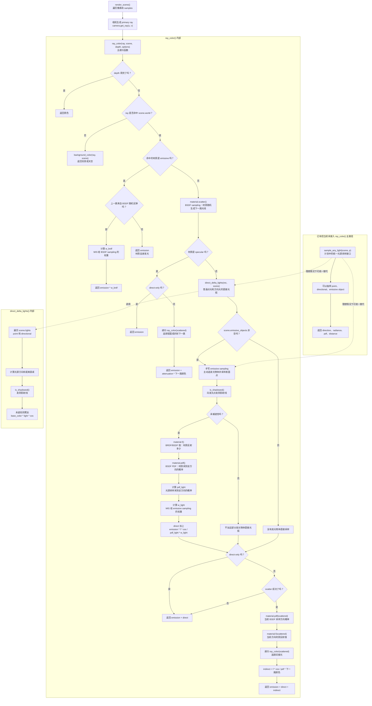

# 渲染流程

本文档说明当前共享渲染核心中的主要渲染路径，用于后续维护光源采样、MIS、Blender 接入和材质支持时对照更新。

## 当前路径

## 流程中的术语

`primary ray` 是从相机穿过某个像素发出的第一条光线。

`samples` 是每个像素发出的采样光线数量。采样越多，随机噪声通常越低，但渲染耗时也越高。

`ray_color()` 是主递归函数。相机光线会先进入它，材质反弹出来的新光线也会再次递归进入它。

`depth` 是当前光线还允许递归反弹的剩余深度。它用完后返回黑色，用来避免光线无限反弹。

`scene.world` 是场景的可求交加速结构。当前会是 BVH 或普通 hittable list，`ray_color()` 通过它判断光线命中了哪个物体。

`emission` 是材质自身发出的光。`emissive` 材质不需要被其他光源照亮，也可以被相机直接看到。

`specular` 在当前代码里表示镜面/折射类材质路径，例如金属镜面反射和玻璃折射。它们的下一跳方向由材质决定，渲染器不会在这个命中点上额外计算普通漫反射式的直接光照。

`attenuation` 是材质散射时返回的颜色衰减系数。反弹光线递归返回颜色后，会乘上这个系数，用来表示这次反射或折射吸收了多少光、保留了多少颜色。

`direct-only` 是快速预览模式。开启后，普通非镜面材质只返回自身发光和直接光照，不继续递归追踪随机反弹得到的间接光；镜面/玻璃这类 `specular` 材质在 direct-only 下也不会继续追踪下一跳。

`direct_delta_lights()` 计算理想零面积光源的直接光照，目前包括点光源和方向光。它会向光源方向发阴影射线，用来判断光源是否可见。

`delta light` 是没有可采样面积的理想光源。当前代码里的点光源和方向光都属于这一类：点光源被看作一个点，方向光被看作来自无限远的固定方向。

`base_color` 是当前材质的基础颜色。`direct_delta_lights()` 里用它做了简化的直接光照计算，因此普通点光/方向光这一路目前没有完整走 `material.f()` 的 BRDF/BSDF 评估。

`shadow ray` 是从当前着色点射向光源的可见性检测光线。如果它在到达光源前撞到别的物体，就说明这个光源被遮挡。

`emissive sampling` 是显式采样发光物体：渲染器主动在发光物体表面取一个点，然后向这个点发阴影射线。它是发光表面的 next event estimation，也就是“不要等随机反弹碰巧打到光源，而是主动采样光源”的做法。

`BSDF` 全称是 Bidirectional Scattering Distribution Function，双向散射分布函数。它描述光线打到材质表面后，会如何向不同方向散射。这里的“散射”比“反射”更宽泛：既可以是漫反射、镜面反射，也可以包括玻璃这类透射/折射。

`BRDF` 全称是 Bidirectional Reflectance Distribution Function，双向反射分布函数。它是 BSDF 的一个子集，只描述表面反射，不描述透射。普通漫反射、金属高光、粗糙表面反射通常可以理解为 BRDF；玻璃、水这类会让光穿过去的材质则需要更一般的 BSDF 来描述。

`BSDF sampling` 是由材质驱动的随机散射。代码里对应 `material.scatter()`，它会根据材质类型生成下一条反弹或折射光线。比如漫反射材质会在表面上方随机选方向，金属会更偏向反射方向，玻璃可能反射也可能折射。

`BRDF/BSDF value` 由 `material.f()` 返回，表示材质在给定入射/出射方向上会反射或散射多少光。直接光照里，渲染器已经知道“光从哪个方向来、相机在看哪个方向”，于是需要用 `f()` 问材质：这束光有多少会被反射或散射到相机方向。间接光里，`f()` 也用于给 `scatter()` 随机选出的下一跳方向计算权重。

`cos` 指当前表面法线和光线方向夹角的余弦。表面越正对光源，这个值越大；越斜着被照到，这个值越小。这是 Lambert 余弦项，也是直接光照和间接光权重里常见的几何因子。

`PDF` 是概率密度。`material.pdf()` 表示 BSDF sampling 采到某个方向的概率密度；`pdf_light` 表示通过光源采样采到某个方向的概率密度。

`MIS` 是 multiple importance sampling，多重重要性采样。在当前流程里，它用来平衡两种找到发光物体路径的方法：主动采样发光物体得到的路径使用 `w_light`，通过 BSDF 随机反弹碰到发光物体得到的路径使用 `w_brdf`。

`sample_any_light()` 是计划中的统一光源采样接口。它已经存在于 scene 层，但当前 `ray_color()` 主路径仍然使用 `direct_delta_lights()` 加一段单独手写的 emissive sampling 逻辑。

`direction`、`radiance`、`pdf`、`distance` 是 `sample_any_light()` 计划返回的一组光源采样信息：光从哪个方向来、光源沿这条样本路径贡献多少亮度、这个样本被采到的概率密度、以及光源距离当前点有多远。
