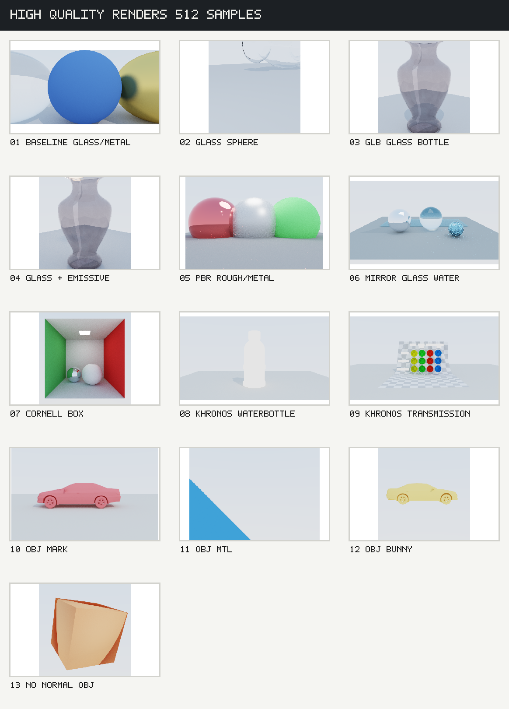

# High Quality Render Review - 2026-07-01

Generated from 512-sample renders in `renders/high_quality_20260701/`.



## Render Set

Command pattern:

```bash
./raytracer --scene scenes/<scene>.json --samples 512 --seed <fixed-seed> --tone-map aces --out renders/high_quality_20260701/<scene>_s512.png --stats
```

All 13 renders were verified as valid 8-bit RGB PNG files. The full per-image metric dump is stored in `docs/render_reviews/assets/high_quality_render_metrics.json`.

Post-review update: the `khronos_water_bottle` failure was traced to GLB emissive texture routing. The material now remains PBR while `emissiveTexture` contributes a separate emission term; a 64-sample smoke render confirmed that the bottle body, label, and bottom material are visible again. Transparent material noise/depth remains tracked as follow-up render quality work.

## Acceptance Summary

| # | Scene | Result | Notes |
|---|-------|--------|-------|
| 01 | `three_balls` | Pass | Baseline glass/metal/diffuse scene renders cleanly. Refraction and shadows are readable at 512 samples. |
| 02 | `glass` | Needs work | Glass is visible but the composition is weak: object is clipped/high in frame and the material reads more like pale transparency than thick glass. |
| 03 | `glass_bottle` | Pass with caveats | Bottle silhouette and refraction are clear. Still lacks absorption/tint depth, so it looks flatter than real glass. |
| 04 | `glass_emissive` | Pass with caveats | Emissive area lighting is working through/around glass. Noise is acceptable but caustic-like energy remains rough. |
| 05 | `pbr_test` | Pass with caveats | Rough/metallic differences are visible. Some highlight fireflies/noise remain on glossy surfaces. |
| 06 | `mirror_glass_water` | Pass with caveats | Mirror, glass, water plane, PBR sphere, and emissive sampling all appear. Blue PBR sphere/water region still shows high-frequency sparkle. |
| 07 | `cornell_box` | Pass | Area light, colored walls, glass/white spheres, and indirect lighting are readable. Good regression/showcase candidate. |
| 08 | `khronos_water_bottle` | Needs work | The WaterBottle GLB renders as an over-bright white silhouette, indicating material/texture handling is incomplete or exposure/material routing is wrong for this asset. |
| 09 | `khronos_transmission_test` | Pass with caveats | Transmission test grid and colored spheres are visible. True transmission/volume behavior is still approximate. |
| 10 | `mark` | Pass with caveats | OBJ model loads and frames correctly. Missing upstream `mark.mtl` is tolerated, but fallback material makes it a single pink object. |
| 11 | `obj_mtl_test` | Pass | OBJ `.mtl` `Kd` / `map_Kd` path is exercised. Scene is intentionally minimal and should stay a small import smoke test. |
| 12 | `bunny_test` | Pass with caveats | OBJ mesh import and auto framing work. Material is a simple fallback; not a material-quality test yet. |
| 13 | `no_normal_obj` | Pass | Missing-normal OBJ path renders with generated normals; faceting is expected for this fixture. |

## Priority Findings

1. **GLB material fidelity is now the highest-value fix.** `khronos_water_bottle` is the clearest failure: it should show label/texture/material variation, but currently reads as a white cutout. This points at incomplete use of imported GLB texture/material channels.
2. **Transparent material quality needs real absorption.** Glass and bottle scenes are structurally correct, but clear dielectrics do not yet show convincing Beer-Lambert tint, attenuation distance, or thicker-object color depth.
3. **Glossy/PBR fireflies need targeted sampling controls.** `pbr_test` and `mirror_glass_water` reveal residual bright speckles around glossy highlights and small reflective/refractive objects.
4. **Golden regression coverage should expand to one GLB and one OBJ MTL scene.** Current golden tests cover default and mirror/glass/water. Add small deterministic versions of WaterBottle/Transmission and OBJ MTL to guard importer behavior.
5. **Performance profiling should focus on transparent/area-lit scenes.** The slowest 512-sample scenes were `glass_bottle`, `cornell_box`, `glass_emissive`, and `khronos_transmission_test`, which suggests transparent bounce depth and emissive/area light sampling are the first places to inspect.

## Next Implementation Order

1. Make parsed GLB material fields affect shading: `normalTexture`, `metallicRoughnessTexture`, `emissiveTexture`, and `KHR_materials_volume`.
2. Improve glass/water: absorption/attenuation, better transparent albedo semantics, and lower firefly risk around refractive paths.
3. Expand golden image regression with deterministic mini GLB/OBJ MTL cases.
4. Profile and optimize the slow transparent/area-lit scenes using existing `--stats` and `scripts/benchmark.sh`.
